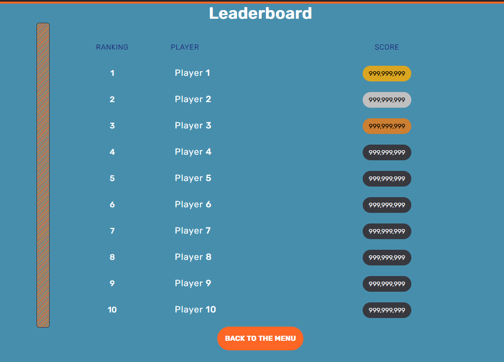
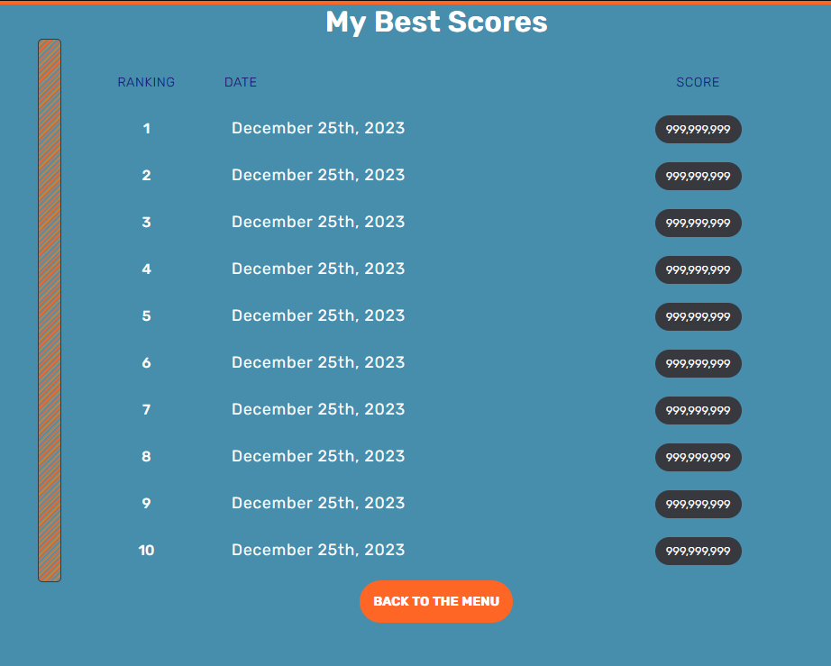
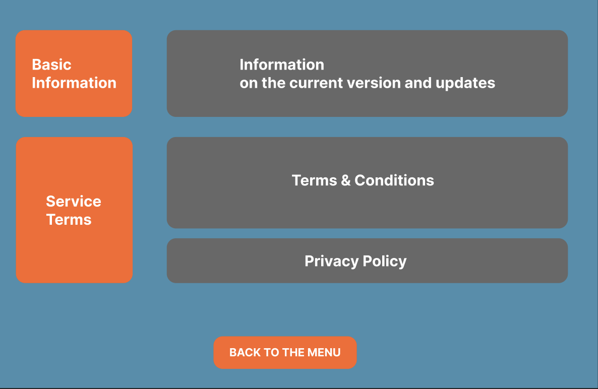

# Page Title: Game Home (index.html)

## Page Description:
This will be the home screen or main menu of our project. It will be the hub for accessing other pages.

## Parameters for the page:
1. My Best Score Button
2. Leaderboard Button
3. Explanation Button
4. Settings Button
5. Game Selection Button

## Data Needed to Render Page:
1. Two-column structure
2. Background Color
3. Button Color
4. Button Hover Color
5. Interactivity
6. Image Source

## Link Destinations:
1. My Best Score -> mybestscore.html (a personal leaderboard)
2. Leaderboard -> leaderboard.html (a leaderboard of all players)
3. Explanation -> gamerules.html (an explanation of the rules for the game)
4. Setting -> setting.html (a menu page for changing settings related to the game)

## Tests to Verify Rendering
1. Visual Testing - Each page will be manually checked on various browsers
2. Functional Testing - Each button will be clicked on various browsers to ensure they are functioning correctly
3. Cross-Browser Testing - Each page will be checked in different browsers to ensure that they are rendering correctly
4. Responsive Testing - Each page will be checked on browsers/devices of different screen sizes
5. Regression Testing - Each time new elements are added or modified on the page, it will undergo all previous tests

# Page Title: Game Explanation (gamerules.html)

## Page Description:
This page will contain all the information regarding the rules of the game. It will also have a back to menu button to allow players to return to the main menu after reading the rules.

## Parameters for the Page
1. Return to menu button
2. At least 3 containers with rules for the game
3. Title of the page ("Game Explanation")

## Data Needed to Render Page:
1. Layout information - Alignment and spacing for rule containers
2. Color information - background, buttons, rule containers
3. Content - Text for rules
4. Button style information

## Link Destinations:
1. Back to Menu Button -> Game Home (index.html) Returns the user to the main menu

## Tests to Verify Rendering
1. Visual Testing - Each page will be manually checked on various browsers
2. Functional Testing - Each button will be clicked on various browsers to ensure they are functioning correctly
3. Cross-Browser Testing - Each page will be checked in different browsers to ensure that they are rendering correctly
4. Responsive Testing - Each page will be checked on browsers/devices of different screen sizes
5. Regression Testing - Each time new elements are added or modified on the page, it will undergo all previous tests

# Page Title: Leaderboard (leaderboard.html)

## Page Description
This page features the top ten scores from around the globe, providing players with a glimpse of the current top achievers and the scores they need to beat to claim the number one spot. Check back regularly to stay updated and challenge yourself to reach the pinnacle of the leaderboard!

## Parameters for the Page
1. Return to menu button
2. Top ten scores
3. Title of the page

## Data Needed to Render Page:
1. Layout information - Alignment and spacing for rule containers
2. Color information - background, buttons, rule containers
3. Sub-query to get the top ten scores from DB
4. Anchor button style information

## Link Destinations:
1. Back to Menu Button -> Game Home (index.html) Returns the user to the main menu

## Tests to Verify Rendering
1. Visual Regression Testing: Use tools like BackstopJS, Percy, or Applitools to capture screenshots of your web page and compare them against a baseline to identify visual differences.
2. Manual Testing: Manually inspect the rendered page across different browsers and devices to ensure consistency and correctness.
3. Automated Browser Testing: Use tools like Selenium, Puppeteer, or Playwright to automate the testing process across different browsers and devices, checking for rendering issues.
4. Accessibility Testing: Use tools like Axe or Lighthouse to test the web page for accessibility issues, ensuring it renders correctly for users with disabilities.
5. Performance Testing: Use tools like Lighthouse or WebPageTest to evaluate the page's performance, including rendering speed, to ensure a smooth user experience.
6. Cross-Browser Compatibility Testing: Test the web page on different browsers (Chrome, Firefox, Safari, Edge, etc.) and devices (desktop, mobile) to ensure consistent rendering.
7. Responsive Design Testing: Use tools like Responsive Design Mode in browsers or BrowserStack to test how the page renders on different screen sizes and resolutions.
API Testing: use tools like Postman or Swagger to test the API endpoints for correct responses.

# Page Title: My Best Scores (leaderboard.html)

## Page Description
This page features the top ten scores from around the globe, providing players with a glimpse of the current top achievers and the scores they need to beat to claim the number one spot. Check back regularly to stay updated and challenge yourself to reach the pinnacle of the leaderboard!

## Parameters for the Page
1. Return to menu button
2. Top ten scores for the desired player
3. Title of the page

## Data Needed to Render Page:
1. Layout information - Alignment and spacing for rule containers
2. Color information - background, buttons, rule containers
3. Sub-query to get the top ten scores from DB
4. Anchor button style information

## Link Destinations:
1. Back to Menu Button -> Game Home (index.html) Returns the user to the main menu

## Tests to Verify Rendering
1. Visual Regression Testing: Use tools like BackstopJS, Percy, or Applitools to capture screenshots of your web page and compare them against a baseline to identify visual differences.
2. Manual Testing: Manually inspect the rendered page across different browsers and devices to ensure consistency and correctness.
3. Automated Browser Testing: Use tools like Selenium, Puppeteer, or Playwright to automate the testing process across different browsers and devices, checking for rendering issues.
4. Accessibility Testing: Use tools like Axe or Lighthouse to test the web page for accessibility issues, ensuring it renders correctly for users with disabilities.
5. Performance Testing: Use tools like Lighthouse or WebPageTest to evaluate the page's performance, including rendering speed, to ensure a smooth user experience.
6. Cross-Browser Compatibility Testing: Test the web page on different browsers (Chrome, Firefox, Safari, Edge, etc.) and devices (desktop, mobile) to ensure consistent rendering.
7. Responsive Design Testing: Use tools like Responsive Design Mode in browsers or BrowserStack to test how the page renders on different screen sizes and resolutions.
API Testing: use tools like Postman or Swagger to test the API endpoints for correct responses.

# Page Title: Setting (setting.html)

## Page Description:
This setting interface presents tools for user feedback, essential application details, and outlines service agreements and privacy commitments.

## Parameters for the page:
1. Title of the page
2. User input from feedback from
3. FAQs
4. Brief description of the application
5. Information of version and update
6. Terms and condition document
7. Privacy policy document (If necessary)
8. Return to menu button

## Data Needed to Render Page:
1. Layout information - form and text
2. Color information - background, button, form, text
3. Content - Text for FAQs, brief description of the application, version and update, terms and condition, and privacy policy
4. Button style information

## Link Destinations:
1. Back to Menu Button -> Game Home (index.html) Returns the user to the main menu

## Tests to Verify Rendering
1. Visual Testing: Manually check each section (Help, Basic Information, Service Terms) on the settings page on my browser for consistency.
2. Functional Testing: Test the functionality of the feedback form 'SEND' button in different browsers to ensure it submits data as intended. Verify that the 'BACK TO THE MENU' button returns to the main menu in each browser.
3. Cross-Browser Testing: Check the settings page in different browsers (Chrome, Safari, Edge, etc.) to ensure elements like the column layout and buttons render correctly.
Responsive Testing: Ensure the settings page layout is responsive and appears correctly on various devices and screen sizes, particularly the alignment and readability of the texts.
4. Regression Testing: After any updates or changes to the page, such as text updates or layout adjustments, retest to confirm that previous functionalities remain intact and visual consistency is maintained.
