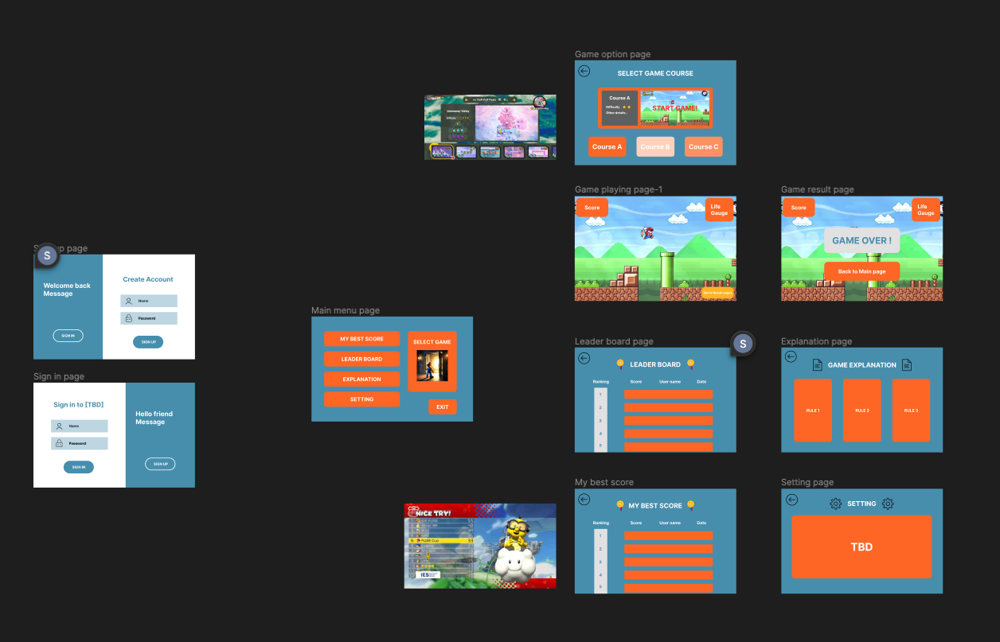
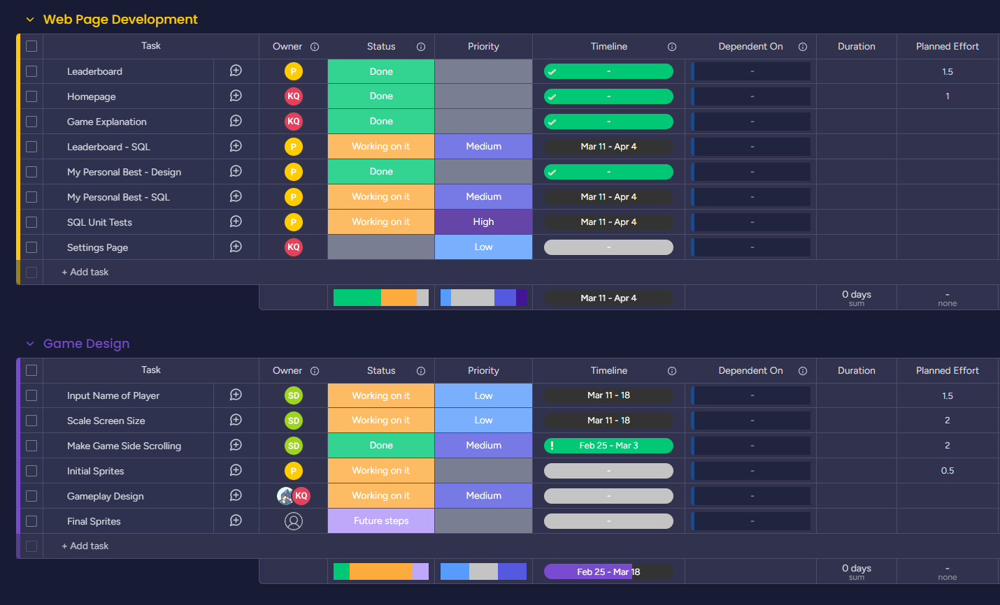
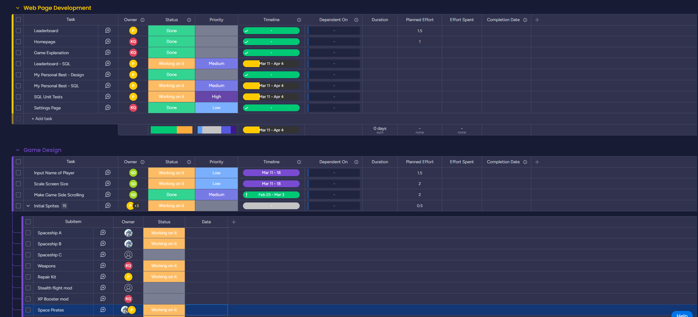
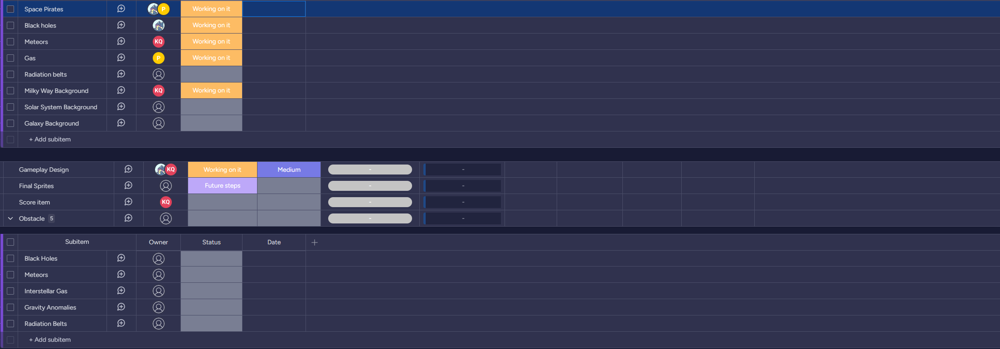
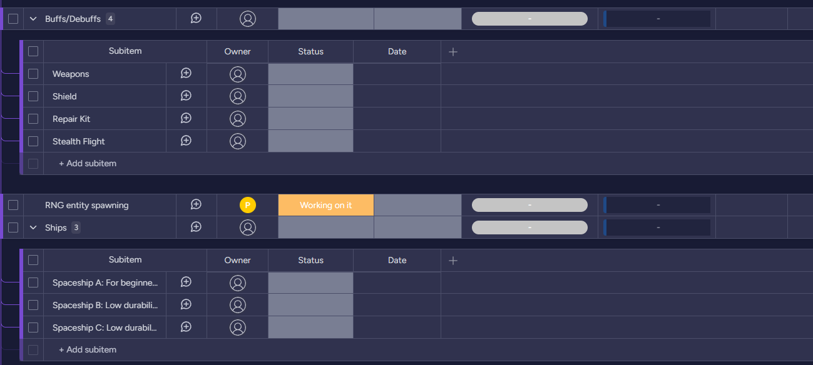

     
 

 

## Work-in-Progress
- Web Pages: Leaderboard and index
- Gameplay Design
- Gameplay Code: Player name input, scrolling screen, and screen scaling

 

 

## Finished Work
- leaderboard.html
- index.html

## Work-in-Progress
- Webpages: Game Explantiona and  myBestScore
- Gameplay Code: PLayer name input, scrolling screen, and screen scaling
- Gameplay Design

 

## Finished Work
- myBestScore.html
- gamerules.html
- GameDesign.md
- Screen scrolling

## Work-in-Progress
- Webpage: Settings page
- SQL: UnitTests and API
- Gameplay Code: PLayer name input and screen scaling
- Gameplay Design
- Sprites and Creative Game Design

## Finished Work
- Spaceship spirtes
- addPlayer() function for SQL DB w/ Tests
- Settings/Credits page

## Work-in-Progress
- Sprites
- SQL: UnitTests and API
- Gameplay Code: RNG, Score Items, and player name input
- Gameplay Design
- Creative Game Design